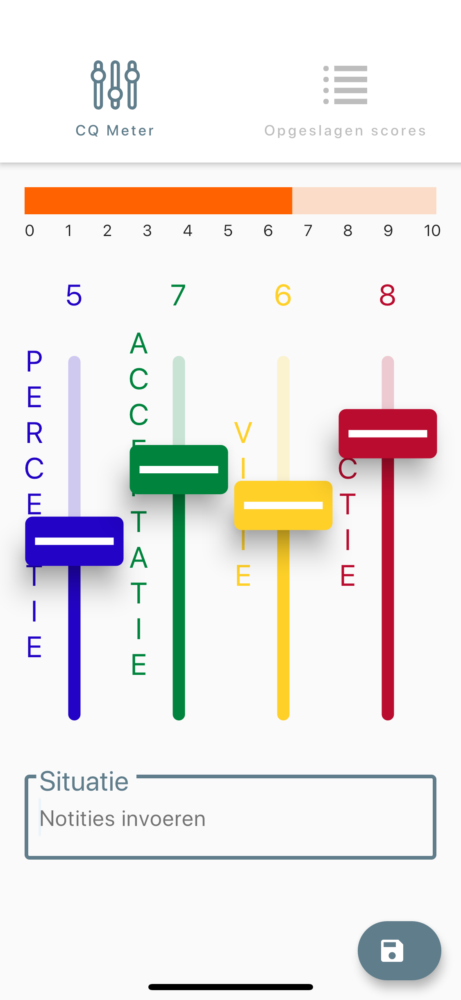
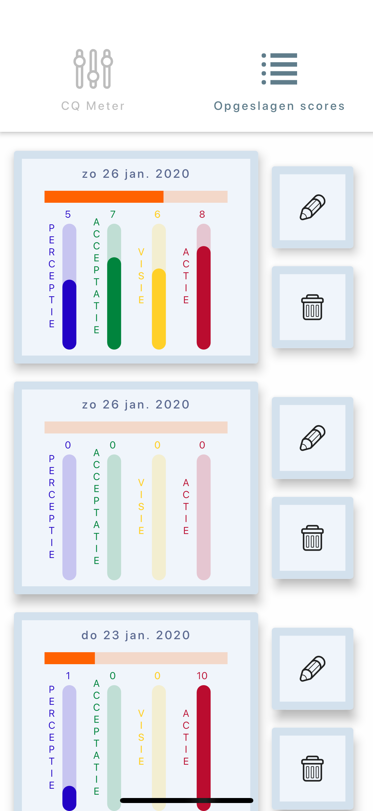
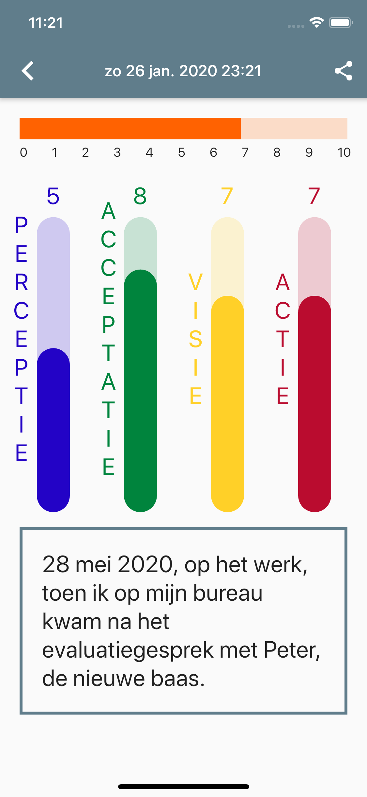

# De Geluksmeter - The Happiness Meter

A cross-platform Flutter application for Joost Vanhoove's PAVA-bewustzijnsmodel course

Developer contact: AdrianFRoberts@gmail.com

<table>
    <tr>
      <th></th>
       <th></th>
       <th></th>
  </tr>
</table>

